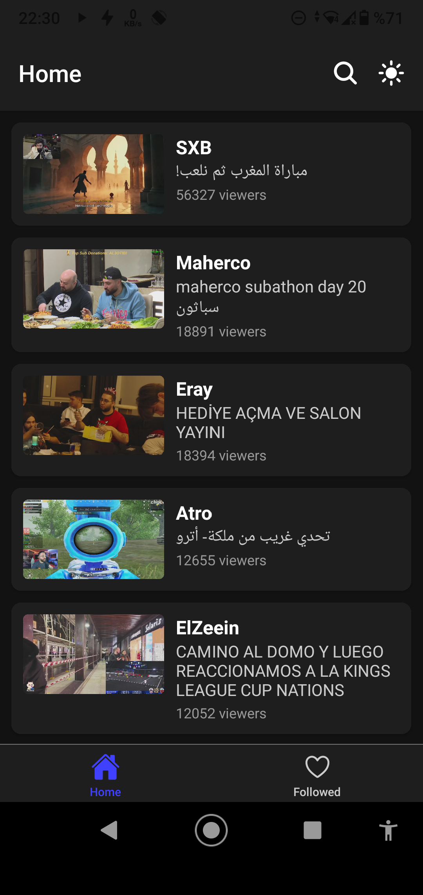
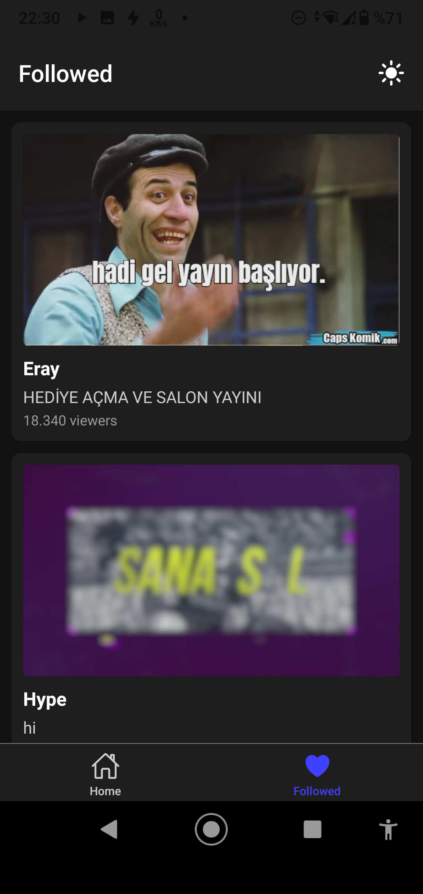
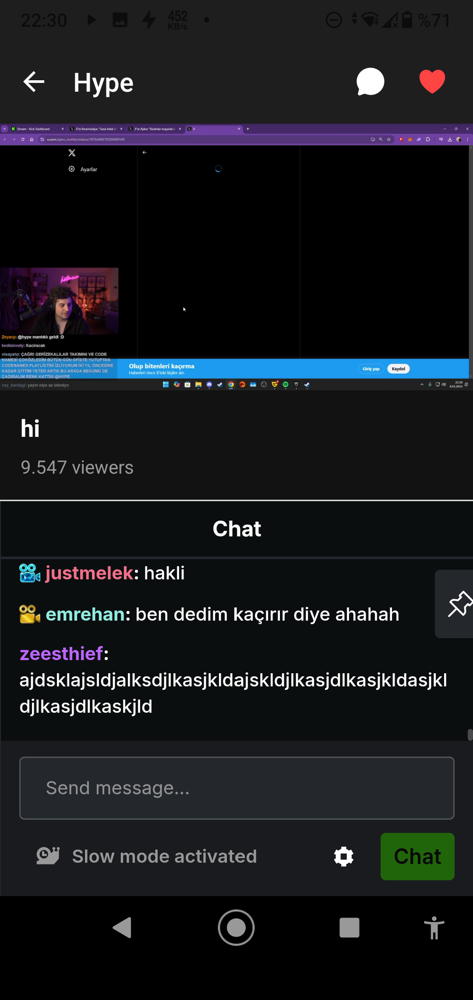

# KickLiteApp

A React Native mobile application for watching Kick.com live streams. Built with Expo and styled with NativeWind.

## Features

- 🎮 Browse live streams sorted by viewer count
- 🔍 Search for specific channels
- ❤️ Follow your favorite streamers
- 💬 Live chat integration
- 🌓 Dark/Light theme support
- 📱 Picture-in-Picture support (iOS)
- 📺 Fullscreen mode with automatic orientation
- 🔄 Pull-to-refresh functionality

## Screenshots

<div style="display: flex; justify-content: space-between; margin-bottom: 20px;">
  
  
  
</div>

| Screen   | Description                                                     |
| -------- | --------------------------------------------------------------- |
| Home     | Browse live streams sorted by viewer count with infinite scroll |
| Followed | Track your favorite streamers with live status indicators       |
| Stream   | Watch live streams with chat integration and PiP support        |

## Tech Stack

- React Native with Expo
- TypeScript
- NativeWind (Tailwind CSS)
- React Navigation
- Expo AV for video playback
- AsyncStorage for local data persistence
- WebView for chat integration

## Prerequisites

- Node.js (v14 or newer)
- npm or yarn
- Expo CLI
- iOS Simulator or Android Emulator (optional)

## Installation

1. Clone the repository:

```bash
git clone [repository-url]
cd KickLiteApp
```

2. Install dependencies:

```bash
npm install
```

3. Start the development server:

```bash
npm start
```

4. Run on your device:

- Scan the QR code with Expo Go (Android)
- Scan the QR code with Camera app (iOS)
- Press 'i' for iOS simulator
- Press 'a' for Android emulator

## Project Structure

```
src/
├── components/
├── screens/
│   ├── HomeScreen.tsx
│   ├── StreamScreen.tsx
│   ├── SearchScreen.tsx
│   └── FollowedScreen.tsx
├── services/
│   └── api.ts
├── context/
│   ├── ThemeContext.tsx
│   └── FollowContext.tsx
└── types/
    └── index.ts
```

## Features in Detail

### Home Screen

- Lists live streams sorted by viewer count
- Pull-to-refresh to update the list
- Infinite scroll for loading more streams
- Quick access to search and theme toggle

### Stream Screen

- Live stream playback with native controls
- Picture-in-Picture support on iOS
- Chat integration with toggle functionality
- Follow/Unfollow streamers
- Automatic orientation handling for fullscreen

### Search Screen

- Real-time channel search
- Live status indicators
- Follower count display
- Verified channel badges

### Followed Screen

- List of followed channels
- Live status and viewer counts
- Thumbnail previews for live channels
- Quick access to streams

## API Integration

The app uses the following Kick.com API endpoints:

- Channel Info: `https://kick.com/api/v2/channels/{username}`
- Live Streams: `https://kick.com/stream/livestreams/tr`
- Search: `https://search.kick.com/multi_search`

## Contributing

1. Fork the repository
2. Create your feature branch (`git checkout -b feature/amazing-feature`)
3. Commit your changes (`git commit -m 'Add some amazing feature'`)
4. Push to the branch (`git push origin feature/amazing-feature`)
5. Open a Pull Request

## License

This project is licensed under the MIT License - see the [LICENSE](LICENSE) file for details.

## Acknowledgments

- [Kick.com](https://kick.com) for the streaming platform
- [Expo](https://expo.dev) for the development framework
- [NativeWind](https://nativewind.dev) for the styling solution
